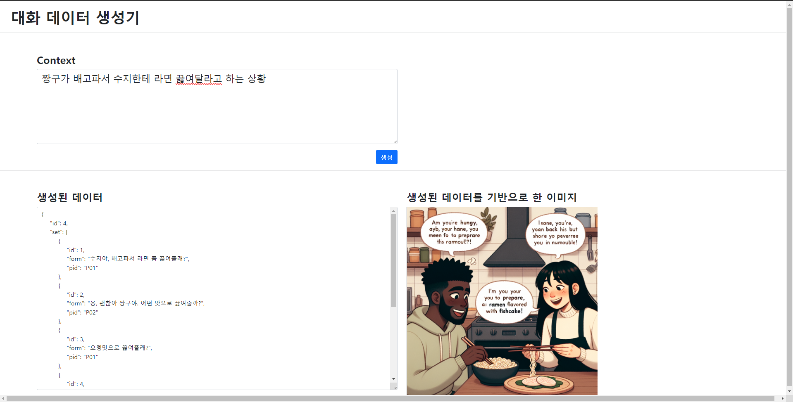

# GPT를 튜닝하여 대화 데이터 및 이미지 생성 프로젝트

## 소개

이 README 문서는 GPT 모델을 튜닝하여 대화 데이터를 생성하는 프로젝트에 대한 개요를 제공합니다. 대화 데이터셋을 생성하기 위해 GPT-Turbo 모델의 능력을 활용합니다. 또한, 데이터 표현을 풍부하게 하기 위해 DALL-E 3 모델을 사용하여 해당 이미지를 생성합니다.

## 기술 스택

- **Express**: Node.js 웹 애플리케이션 프레임워크로, 최소한의 구조와 유연성을 제공합니다.
- **GPT-Turbo**: 대화 데이터 생성을 위해 튜닝된 인공 지능 모델입니다.
- **DALL-E 3**: 이미지 생성 모델로, 텍스트 설명을 바탕으로 고품질의 이미지를 생성합니다.

## 프로젝트 기능

1. **대화 데이터 생성**: GPT-Turbo 모델을 사용하여 자연스러운 대화 데이터를 생성합니다.
2. **이미지 생성**: 생성된 대화에 맞는 이미지를 DALL-E 3 모델을 통해 생성하여 대화의 맥락을 시각적으로 강화합니다.

## 사용 방법

- **필요 조건**:
  - OpenAI의 API 키가 필요합니다.
  - Node.js가 설치되어 있어야 하며, 개발에 사용된 버전은 18.16.1입니다.

- **실행 방법**:
  1. GitHub에서 프로젝트를 클론합니다: `git clone https://github.com/jeonghoHub/gpt-data-generator.git`
  2. 프로젝트 디렉토리로 이동합니다: `cd gpt-data-generator`
  3. `npm install`를 실행하여 관련 라이브러리 들을 설치 합니다.
  4. `node index.js`를 실행하여 서버를 시작합니다.
  5. 브라우저에서 `localhost:5000`으로 접속하여 웹 인터페이스를 사용합니다.

## 결과

## 결론

이 프로젝트는 GPT와 DALL-E 모델의 잠재력을 활용하여 새로운 방식의 대화 데이터 생성을 탐색합니다. AI 기반 콘텐츠 생성의 기반을 다집니다.